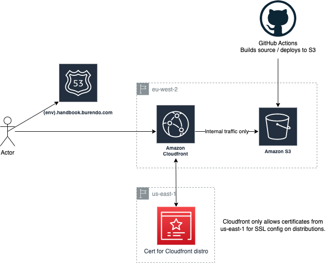

# Burendo Handbook Infrastructure

This repo contains the AWS infrastructure for the Burendo Handbook & the pipeline to pull in the content from the content repos, build docusaurus and deploy.

## The Handbook

### Content

To update the content used to create the handbook, modify in the content repo at [burendo-handbook-public](https://github.com/BurendoUK/burendo-handbook-public)

### Architecture

### Running locally

Running locally, you will need to bring in the docs from content repos into burendo-handbook/docs. To do this, check out the [content repo](#content), then copy the `docs` folder to the local checked out infra repo within the `burendo-handbook` folder (the `docs` folder is git ignored from this folder).

This repository, as with almost all our others, uses a `Makefile` to simplify and standardise on-boarding and use of the repos content.  Run `make` to get a list of commands and their functions.

Then `make handbook-local` to run the Handbook locally.

## Configuration files

Docusaurus has a menu file called `sidebars.js` and a configuration file `docusaurus.config.js`. These files should not be edited without clear knowledge of what you are changing and why.
